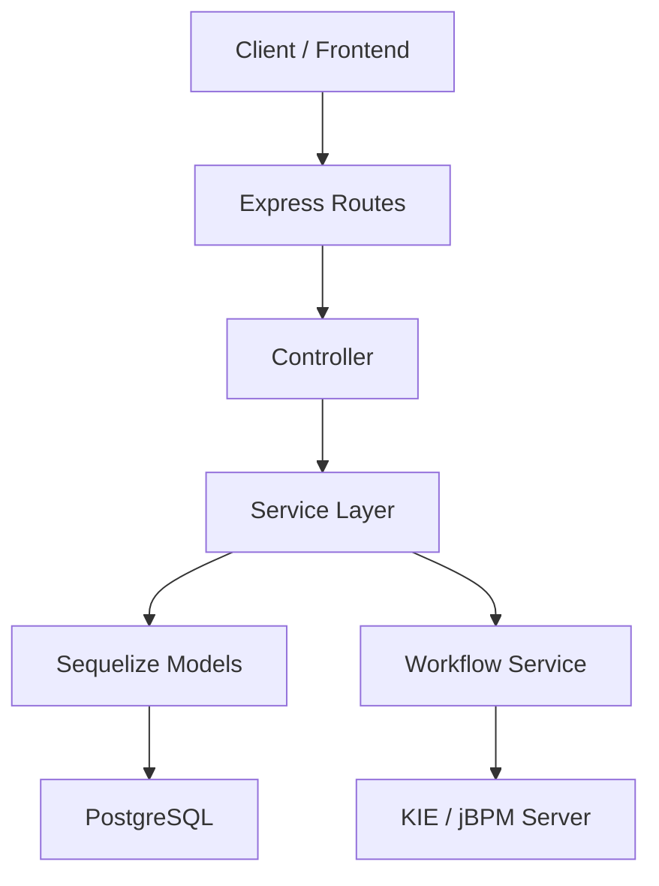

# Workflow Backend Architecture & Knowledge Report

## 1. Project Purpose

This backend is a Node.js/Express application for managing contract requests and their approval workflow. It supports:

- user registration and login
- role-based access control
- contract request CRUD operations
- workflow-driven approvals through a BPMN/KIE engine
- persistence of workflow state in PostgreSQL

The system is designed around a business process where a contract request moves through review stages such as Department Head Review, Procurement Review, Legal Review, and finally Approval or Rejection.

---

## 2. Technology Stack

- Runtime: Node.js
- Web framework: Express
- ORM: Sequelize
- Database: PostgreSQL
- Authentication: JWT + bcryptjs
- Validation: Joi
- Workflow integration: jBPM/KIE Server via Axios
- Security: Helmet, CORS
- Logging: Morgan, Winston-style console logging

---

## 3. High-Level Architecture

The backend follows a layered architecture with clear separation between:

1. API/Route layer
2. Controller layer
3. Service layer
4. Data access/model layer
5. External workflow integration layer
6. Shared infrastructure layer

---

## 4. Architectural Layers

### 4.1 API Layer
Location:
- [src/app.js](src/app.js)
- [src/server.js](src/server.js)
- [src/core/auth/routes.js](src/core/auth/routes.js)
- [src/modules/contract/request/routes.js](src/modules/contract/request/routes.js)

Responsibilities:
- expose HTTP endpoints
- register middleware
- route requests to controllers
- define versioned API structure

### 4.2 Controller Layer
Location:
- [src/core/auth/controllers/AuthController.js](src/core/auth/controllers/AuthController.js)
- [src/modules/contract/request/ContractRequestController.js](src/modules/contract/request/ContractRequestController.js)

Responsibilities:
- receive HTTP request data
- delegate to services
- format response using the API response helper
- pass errors to the global error handler

### 4.3 Service Layer
Location:
- [src/core/auth/services/AuthService.js](src/core/auth/services/AuthService.js)
- [src/modules/contract/request/ContractRequestService.js](src/modules/contract/request/ContractRequestService.js)
- [src/core/workflow/services/WorkflowProcessService.js](src/core/workflow/services/WorkflowProcessService.js)
- [src/core/workflow/services/WorkflowTaskService.js](src/core/workflow/services/WorkflowTaskService.js)

Responsibilities:
- implement business rules
- orchestrate workflows
- validate permissions and decisions
- coordinate between database and external systems

### 4.4 Data Layer
Location:
- [src/core/auth/models/User.js](src/core/auth/models/User.js)
- [src/modules/contract/models/ContractRequest.js](src/modules/contract/models/ContractRequest.js)
- [src/modules/contract/models/ContractAttachment.js](src/modules/contract/models/ContractAttachment.js)
- [src/core/workflow/models/WorkflowDefinition.js](src/core/workflow/models/WorkflowDefinition.js)
- [src/core/workflow/models/WorkflowInstance.js](src/core/workflow/models/WorkflowInstance.js)
- [src/modules/master/models/MasterContractType.js](src/modules/master/models/MasterContractType.js)

Responsibilities:
- define database schemas
- map application objects to PostgreSQL tables
- support persistence, query, update, delete, and soft delete behavior

### 4.5 Integration Layer
Location:
- [src/core/workflow/client/KieClient.js](src/core/workflow/client/KieClient.js)

Responsibilities:
- communicate with the external KIE/jBPM server
- start workflows
- claim/start/complete/release tasks
- query workflow tasks by process instance

### 4.6 Shared Infrastructure Layer
Location:
- [src/shared/middleware/auth.js](src/shared/middleware/auth.js)
- [src/shared/middleware/validate.js](src/shared/middleware/validate.js)
- [src/shared/middleware/errorHandler.js](src/shared/middleware/errorHandler.js)
- [src/shared/responses/ApiResponse.js](src/shared/responses/ApiResponse.js)
- [src/shared/exceptions/AppError.js](src/shared/exceptions/AppError.js)

Responsibilities:
- authentication and authorization
- request validation
- consistent API responses
- centralized error handling

---

## 5. Main Modules

### 5.1 Authentication Module
Purpose: user registration and login.

Key files:
- [src/core/auth/routes.js](src/core/auth/routes.js)
- [src/core/auth/controllers/AuthController.js](src/core/auth/controllers/AuthController.js)
- [src/core/auth/services/AuthService.js](src/core/auth/services/AuthService.js)
- [src/core/auth/models/User.js](src/core/auth/models/User.js)

Behavior:
- registers new users
- validates email uniqueness
- hashes passwords
- issues JWT tokens
- authenticates users using JWT

### 5.2 Contract Request Module
Purpose: manage contract requests and workflow decisions.

Key files:
- [src/modules/contract/request/routes.js](src/modules/contract/request/routes.js)
- [src/modules/contract/request/ContractRequestController.js](src/modules/contract/request/ContractRequestController.js)
- [src/modules/contract/request/ContractRequestService.js](src/modules/contract/request/ContractRequestService.js)
- [src/modules/contract/request/contractRequestValidator.js](src/modules/contract/request/contractRequestValidator.js)
- [src/modules/contract/models/ContractRequest.js](src/modules/contract/models/ContractRequest.js)

Behavior:
- create contract requests
- list requests based on user role and filters
- fetch single request by ID
- update request contents
- delete request
- process workflow decisions

### 5.3 Workflow Module
Purpose: connect business records to BPMN process instances and human tasks.

Key files:
- [src/core/workflow/services/WorkflowProcessService.js](src/core/workflow/services/WorkflowProcessService.js)
- [src/core/workflow/services/WorkflowTaskService.js](src/core/workflow/services/WorkflowTaskService.js)
- [src/core/workflow/client/KieClient.js](src/core/workflow/client/KieClient.js)
- [src/core/workflow/models/WorkflowDefinition.js](src/core/workflow/models/WorkflowDefinition.js)
- [src/core/workflow/models/WorkflowInstance.js](src/core/workflow/models/WorkflowInstance.js)

Behavior:
- resolve workflow definition by code and customer
- start process instances in KIE
- track instances in PostgreSQL
- complete human tasks and propagate decision variables to the BPMN engine

### 5.4 Role and Permission Module
Purpose: support authorization and role assignment.

Key files:
- [src/core/roles/models/Role.js](src/core/roles/models/Role.js)
- [src/core/permissions/models/Permission.js](src/core/permissions/models/Permission.js)
- [src/core/roles/models/UserRole.js](src/core/roles/models/UserRole.js)
- [src/core/permissions/models/RolePermission.js](src/core/permissions/models/RolePermission.js)

Behavior:
- define roles and permissions
- support role-based authorization logic
- prepare the system for fine-grained access management

---

## 6. Data Flow

### 6.1 Authentication Flow

1. Client sends credentials to /api/v1/auth/login or /api/v1/auth/register.
2. Route forwards request to the auth controller.
3. Controller calls AuthService.
4. AuthService checks the database through the User model.
5. If valid, it creates a JWT and returns the token and user info.
6. The client stores the token and sends it in the Authorization header for protected routes.

### 6.2 Contract Request Creation Flow

1. Client sends a POST request to /api/v1/contract-requests.
2. Middleware authenticates the user and validates request payload.
3. Controller calls ContractRequestService.createRequest.
4. Service creates a ContractRequest record in PostgreSQL.
5. Service calls WorkflowProcessService.startProcess.
6. WorkflowProcessService resolves the workflow definition and starts a process in KIE.
7. WorkflowInstance is stored locally to track the process.
8. Response is returned to the client.

### 6.3 Workflow Decision Flow

1. A reviewer calls POST /api/v1/contract-requests/:id/decision.
2. Middleware checks authentication and role authorization.
3. Controller routes request to ContractRequestService.processDecision.
4. Service validates that the current request is assigned to the reviewer’s group.
5. Service resolves the next workflow state and BPMN gateway variables.
6. WorkflowTaskService completes the current human task in KIE.
7. KIE evaluates the BPMN decision and advances the process.
8. The contract request record in PostgreSQL is updated with the new status and group.
9. Timeline is appended with the reviewer action.

### 6.4 Generic Update Flow

1. Client sends PUT /api/v1/contract-requests/:id.
2. Authentication middleware validates the token.
3. Controller forwards the update request.
4. Service checks authorization rules.
5. The contract request is updated directly in the database.

---

## 7. API Reference

### Health
- GET /health
- Purpose: server health check

### Authentication
- POST /api/v1/auth/register
- Purpose: create a new user account
- POST /api/v1/auth/login
- Purpose: authenticate a user and return a JWT

### Contract Requests
- GET /api/v1/contract-requests
- Purpose: list contract requests; role-based filtering
- GET /api/v1/contract-requests/:id
- Purpose: fetch a single contract request
- POST /api/v1/contract-requests
- Purpose: create a contract request and start workflow
- PUT /api/v1/contract-requests/:id
- Purpose: update contract content or workflow-related fields
- DELETE /api/v1/contract-requests/:id
- Purpose: delete a contract request
- POST /api/v1/contract-requests/:id/decision
- Purpose: submit workflow approval/rejection/sent-back decision

---

## 8. Core Data Models

### User
Represents an application user.
Fields include:
- id
- username
- email
- password
- firstName
- lastName
- role
- isActive

### ContractRequest
Represents a business contract request.
Key fields:
- id
- title
- description
- requester_id
- department
- vendor
- contract_type
- contract_value
- contract_duration
- scope_of_work
- status
- assigned_to_group
- timeline
- workflow_instance_id

### WorkflowDefinition
Represents the BPMN workflow definition metadata.
Key fields:
- code
- name
- container_id
- process_id
- version
- customer_id
- status

### WorkflowInstance
Represents the runtime link between a business record and a KIE process instance.
Key fields:
- workflow_definition_id
- process_instance_id
- container_id
- business_record_id
- status
- current_task
- current_assignee

### ContractAttachment
Represents uploaded supporting files for a contract request.

### MasterContractType
Represents master data for contract categories.

---

## 9. Security Design

The current backend applies the following protections:

- JWT-based authentication
- role-based authorization for workflow actions
- Joi input validation
- centralized AppError handling
- password hashing using bcrypt
- CORS and Helmet middleware for baseline HTTP protection

Important note: the current authorization mechanism is role-based and simple; it does not yet implement a full permission matrix or policy engine.

---

## 10. Current Strengths

- Clear modular structure for auth and contract workflows
- Good separation between HTTP, business logic, and persistence
- Workflow orchestration is centralized in dedicated services
- External BPMN integration is isolated behind a client adapter
- Error handling is centralized and consistent

---

## 11. Current Gaps and Improvement Opportunities

1. Missing Swagger/OpenAPI documentation
2. No automated tests currently configured
3. No explicit DTO layer for request/response shaping
4. Workflow logic is tightly coupled to service behavior
5. No dedicated logging infrastructure beyond console output
6. Database synchronization via sequelize.sync({ alter: true }) is useful for development but should be controlled more carefully in production
7. The permission model exists but is not fully wired into the business flows

---

## 12. Suggested Future Architecture Evolution

If this project grows, the following improvements would help:

- add Swagger documentation for all APIs
- introduce a repository pattern for data access isolation
- add unit and integration tests
- introduce structured logging with Winston and correlation IDs
- add more explicit domain services for contract management and workflow decisions
- move to a queue/event-based workflow architecture for long-running approvals
- add API versioning and rate limiting

---

## 13. Summary

This project is a layered backend for contract management and workflow-driven approvals. It is organized around Express routes, controllers, services, Sequelize models, and an external BPMN workflow engine integration layer. The main business flow is:

- create a contract request
- start a workflow instance
- route the request through reviewer groups
- process business decisions
- update both the workflow engine and PostgreSQL state

In short, the system is a practical backend foundation for workflow-based contract processing with room for stronger documentation, testing, and governance improvements.
